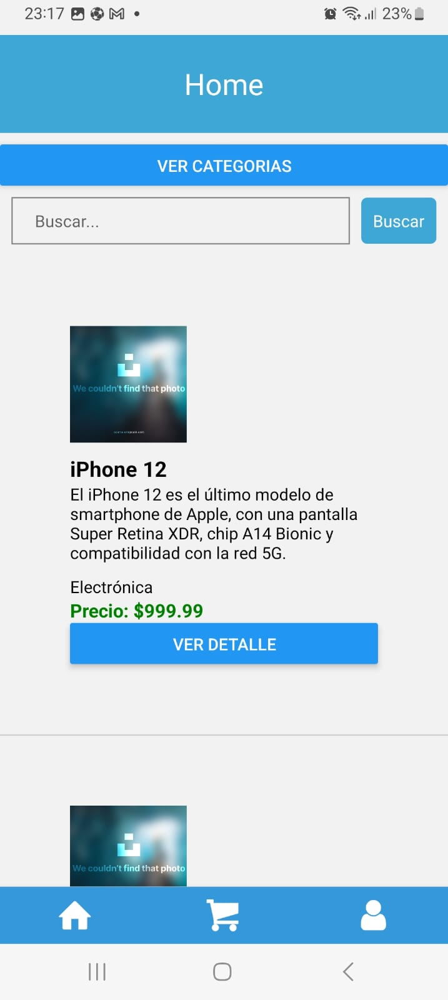
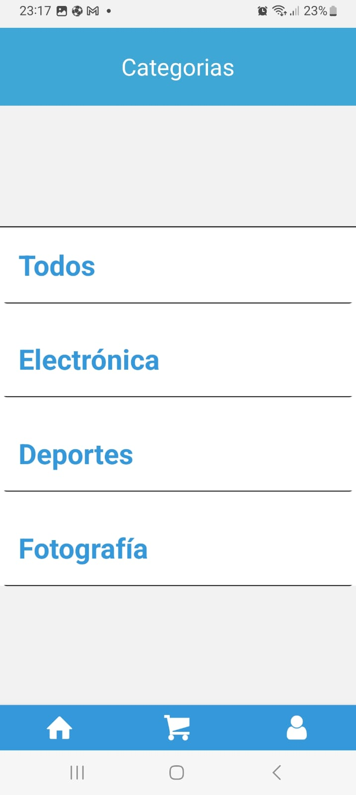
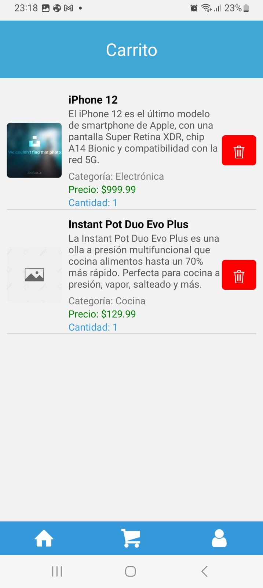

# React-Native E commerce

## Descripción
Esta es una aplicacion e commerce realizada con React Native. Incluye las funciones como ver productos, buscar por categoría, iniciar sesión, registrarse y agregar productos al carrito.

## Capturas de Pantalla

## Características Principales
- Lista de las características principales de tu aplicación.

## Tecnologías Utilizadas
- React Native
- React Navigaton
- Redux
- RTK Query

## Instalación
1. Clona el repositorio: `git clone <URL del repositorio>`
2. Instala las dependencias: `npm install`
3. Inicia la aplicación: `npm start`

## Estructura del Proyecto
El proyecto esta basado en componentes de React Nativa y utilizando React Navigaton para permitir una navegacion eficiente dentro de la aplicacion.

## Contacto
- gastonig2020@gmail.com
- gastoniglesiasdev.com

## Colaboraciones
Esta aplicacion fue realizada como proyecto final para la cursada de Desarrollo de aplicaciones en Coderhouse

---